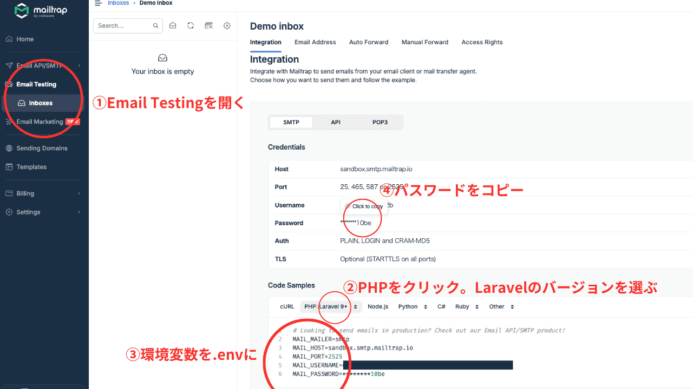
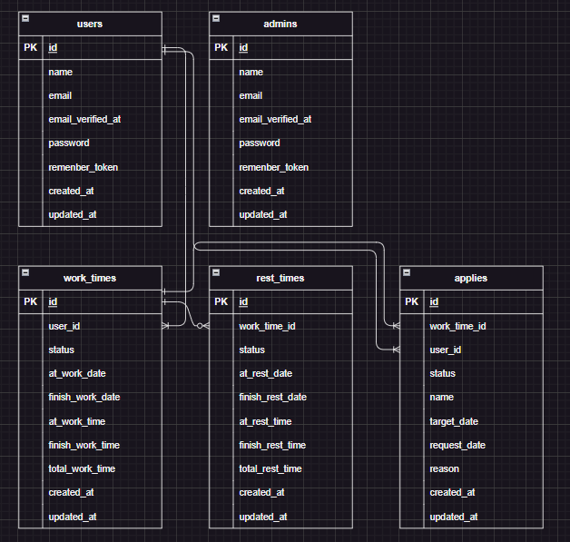

# 勤怠管理

## 環境構築
**Dockerビルド**
1. `git@github.com:yuu-2-hue/attendance.git`
2. DockerDesktopアプリを立ち上げる
3. `docker-compose up -d --build`

**Laravel環境構築**
1. `docker-compose exec php bash`

2. `composer install`

3. 「.env.example」ファイルを 「.env」ファイルに命名を変更。または、新しく.envファイルを作成

4. .envに以下の環境変数を追加
``` text
DB_CONNECTION=mysql
DB_HOST=mysql
DB_PORT=3306
DB_DATABASE=laravel_db
DB_USERNAME=laravel_user
DB_PASSWORD=laravel_pass
```
5. Mailtrapへログイン  
下記URLよりmailtrapへログイン  
<https://mailtrap.io/signin>
> *会員登録していない場合は登録してください*  

6. .envに追加する情報を取得  

``` text
1. 左のメニューから Email Testing を開く
2. PHP をクリックし、Laravel のバージョンを選ぶ
3. 環境変数をコピーし、Laravel プロジェクトの.env に貼り付ける
4. パスワードをコピーし、.env の該当場所に貼り付ける
```

7. .envに以下環境変数を追加
> XXXXは環境によって異なります。
``` text
MAIL_MAILER=smtp
MAIL_HOST=sandbox.smtp.mailtrap.io
MAIL_PORT=2525
MAIL_USERNAME=XXXX
MAIL_PASSWORD=XXXX
MAIL_ENCRYPTION=tls
MAIL_FROM_ADDRESS=test@example.com
MAIL_FROM_NAME="${APP_NAME}"
```

8. アプリケーションキーの作成
``` bash
php artisan key:generate
```

9. マイグレーションの実行
``` bash
php artisan migrate
```

10. シーディングの実行
``` bash
php artisan db:seed
```
11. シンボリックリンク作成
``` bash
php artisan storage:link
```

### 管理者ログイン
管理者でログインする場合は下記内容でログインしてください
``` text
email:admin.example.com
password:password
```

### 一般ユーザーログイン
一般ユーザーでログインする場合は、会員登録画面より会員登録してからログインしてください

### 使用技術
* PHP 7.4.9
* Laravel 8.0
* MySQL 8.0.26
* Mailtrap

### ER図


### URL
* 開発環境：http://localhost
* phpMyAdmin：http://localhost:8080/

